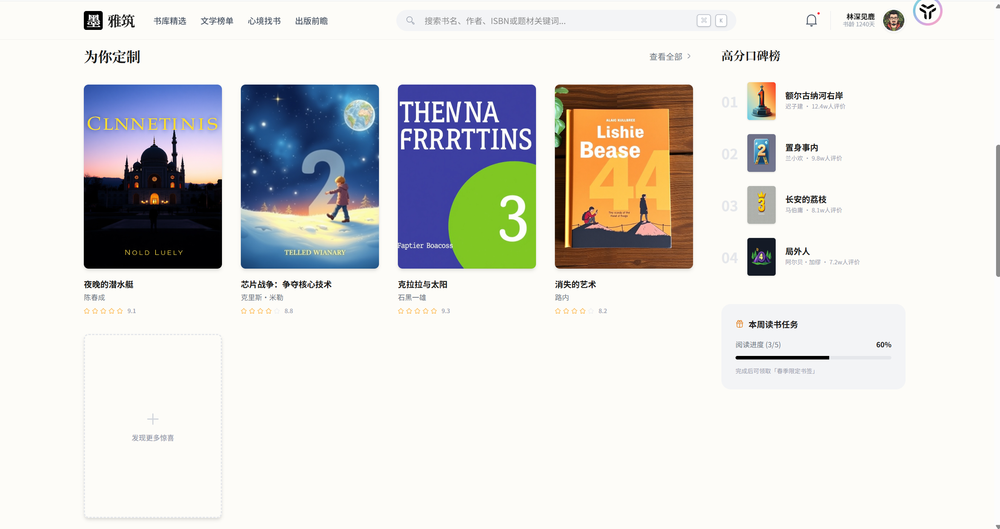

图书推荐系统（BookRecommendSystem），包含用户端首页推荐/书架/搜索等功能，以及基于 RBAC 的后台用户与权限管理。

前端使用 **Vue 3 + TypeScript + Vite + Element Plus**，后端使用 **Python Flask + SQLAlchemy + MySQL + Redis + JWT**。

---

## 项目结构

- **后端（Flask API）**
  - `app/`：核心应用代码
    - `app/__init__.py`：`create_app` 工厂函数、数据库/Redis 初始化、蓝图注册
    - `app/models.py`：用户、角色、权限、图书等模型
    - `app/auth`：认证与登录相关接口
    - `app/user`：用户信息、个人中心相关接口
    - `app/admin`：后台用户与系统管理接口
    - `app/rbac`：基于角色的权限控制（装饰器、权限校验等）
    - `app/api`：首页/书架/搜索等前台 API（给前端 `Home.vue` 等使用）
  - `config.py`：数据库、Redis、JWT 等配置
  - `schema.sql`：MySQL 初始化建表脚本（用户、角色、图书、标签、书评等）
  - `requirements.txt`：后端依赖

- **前端（Vue 3 + Vite）**
  - `frontend/`
    - `src/views/Home.vue`：首页推荐页（Banner、分类、榜单、搜索入口等）
    - `src/views/Login.vue`：登录页
    - `src/router/index.ts`：前端路由
    - 其他组件、样式文件等
  - `frontend/package.json`：前端依赖与脚本

---

## 技术栈

- **前端**
  - Vue 3
  - TypeScript
  - Vite
  - Element Plus
  - Axios（与后端交互）

- **后端**
  - Flask
  - Flask-SQLAlchemy
  - Flask-Redis
  - PyMySQL
  - JWT（`PyJWT`）认证
  - MySQL（推荐使用 8.x）
  - Redis（会话/缓存等）

---

## 快速开始

### 1. 后端启动

1. **创建虚拟环境并安装依赖**

   ```bash
   cd BookRecommendSystem
   python -m venv venv
   venv\Scripts\activate  # Windows
   # source venv/bin/activate  # macOS / Linux

   pip install -r requirements.txt
   ```

2. **准备 MySQL 与 Redis**

   - 创建数据库（名称与 `config.py` 中保持一致，默认 `book_recommend_db`）
   - 更新 `config.py` 中的 `SQLALCHEMY_DATABASE_URI` / `REDIS_URL` 以匹配你的本地环境
   - 使用 `schema.sql` 初始化数据库结构：

   ```bash
   # 在 MySQL 中执行
   mysql -h 127.0.0.1 -P 13306 -u book_user -p book_recommend_db < schema.sql
   ```

3. **配置环境变量（可选但推荐）**

   - `SECRET_KEY`：Flask 会话密钥
   - `DATABASE_URL`：数据库连接字符串（不设置则使用 `config.py` 默认值）
   - `REDIS_URL`：Redis 地址
   - `JWT_SECRET_KEY`：JWT 密钥（不设置则默认等于 `SECRET_KEY`）

4. **运行后端服务**

   推荐使用 Flask 的应用工厂方式：

   ```bash
   set FLASK_APP=app:create_app  # Windows PowerShell 可改为 $env:FLASK_APP="app:create_app"
   set FLASK_ENV=development
   flask run
   ```

   默认监听 `http://127.0.0.1:5000`。

---

### 2. 前端启动

1. 安装依赖：

   ```bash
   cd frontend
   npm install
   ```

2. 启动开发服务器：

   ```bash
   npm run dev
   ```

3. 在浏览器中访问终端输出的地址（通常为 `http://127.0.0.1:5173`），即可访问图书推荐系统前端界面。

> 如需调整后端 API 地址，请在前端 Axios 实例或请求封装中修改基础 URL（例如 `.env` 或单独的 `request.ts` 文件，视你实际实现而定）。

---

## 核心功能

- **首页推荐与发现**
  - 主推图书（Hero 区域），接口示例：`GET /api/books/featured`
  - 分类导航、榜单、猜你喜欢等（由 `Home.vue` 通过多个 API 组合渲染）

- **图书搜索与详情**
  - 全局搜索图书：`GET /api/books/search?q=关键字`
  - 后续可对接真实图书表、全文搜索或推荐算法

- **个人书架**
  - 加入书架：`POST /api/shelf`（需要登录）
  - 与首页 Hero 区域的「加入书架」交互打通

- **通知与消息**
  - 未读通知数量：`GET /api/notifications/unread-count`

- **用户与权限**
  - 用户注册、登录、退出（`/auth` 模块）
  - 获取/修改个人信息（`/user` 模块）
  - 基于角色的权限控制（`/rbac` 模块，使用装饰器统一校验）
  - 管理员对用户与系统配置的管理（`/admin` 模块）

---

## 主要后端接口概览（节选）

- **认证相关**
  - `POST /auth/register`：用户注册
  - `POST /auth/login`：用户登录
  - `POST /auth/logout`：用户登出
  - `GET /auth/check`：检查登录/Token 状态

- **用户相关**
  - `GET /user/profile`：获取当前登录用户信息
  - `PUT /user/profile`：更新个人信息
  - `POST /user/change_password`：修改密码

- **RBAC & 管理后台（根据实际实现为准）**
  - 角色管理：`/rbac/roles`（增删改查）
  - 权限管理：`/rbac/permissions`
  - 用户角色分配：`/rbac/users/<id>/roles`
  - 管理员用户管理：`/admin/users` 系列接口

> 完整接口列表可以通过直接阅读对应 `views.py` 文件（如 `app/api/views.py`、`app/auth/views.py` 等）获取，也可以在后续补充 Swagger / Apifox 等接口文档。

---

## 开发与扩展建议

- 在 `schema.sql` 的基础上继续完善图书、标签、评分、推荐算法等表结构。
- 在 `app/api/views.py` 中，将目前的示例数据替换为真实的数据库查询逻辑。
- 使用统一的请求/响应模型与错误处理机制，便于前后端联调。
- 如需对外开放接口，建议增加跨域（CORS）配置、请求限流与更严格的权限控制。

---

如果你在本地运行或二次开发过程中遇到问题，可以先检查：

1. MySQL / Redis 是否启动且连接配置正确；
2. 数据库是否已经执行过 `schema.sql`；
3. 前端请求的后端基地址是否与 Flask 实际监听地址一致。

4. 页面效果图

