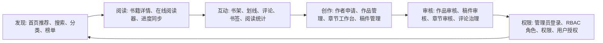

# 产品能力地图

BookRecommendSystem 的主链路可以概括为“发现 -> 阅读 -> 互动 -> 创作 -> 审核 -> 权限”。这条链路覆盖读者、创作者、管理员三类角色，适合作为课程设计、毕业设计或全栈业务原型展示。

## 读者端能力

- 发现：推荐流、热搜、搜索历史、分类、标签、榜单。
- 决策：书籍详情、评分、字数、完结状态、目录预览、相关推荐。
- 阅读：章节正文、目录跳转、主题/字号/行高/边距偏好、进度保存。
- 沉淀：书架、划线、划线评论、书评、书签、阅读统计、阅读成就。

## 创作者端能力

- 入驻：创作者入口和申请状态。
- 作品：创建/编辑作品资料、封面、分类、标签、上架准备度。
- 章节：新增、编辑、排序、提审、版本记录。
- 数据：阅读量、读者画像、作品表现和创作建议。

## 管理端能力

- 治理：用户管理、图书管理、评论管理。
- 审核：创作者申请、作品、稿件、章节审核。
- 权限：角色、权限、角色授权、用户角色和最终权限查询。

## 边界声明

当前系统是学习型阅读平台原型。内容池、推荐结果、阅读统计和作者运营数据用于功能演示，不承诺真实版权、真实收益、真实支付或真实商业运营。
